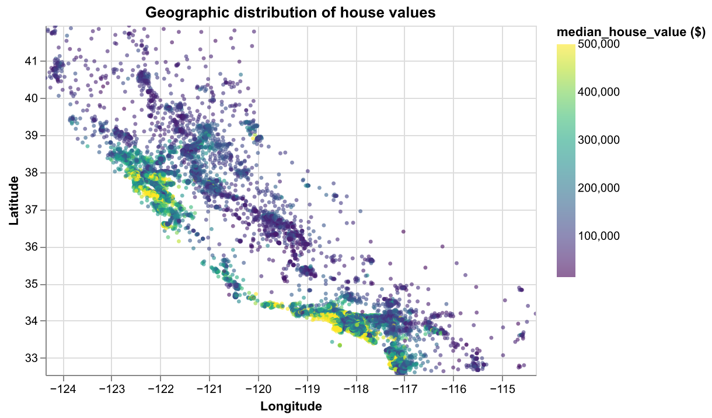

# Milestone 1 Proposal

## Section 1: Motivation and Purpose

**Our role:** Real Estate Analytics Team\
**Target audience:** Real Estate Traders and Urban Economics Researchers

While the 1990 California census data does not reflect current market prices, it provides a historical baseline for understanding the long-term drivers of property value across the state. For real estate traders and urban economics researchers, identifying high-growth patterns requires an analysis of how variables like proximity to the ocean, median income, and house age have historically shaped market premiums. It can be difficult to see the big picture when looking at raw data, often causing users to overlook important geographic clusters, structural patterns, or economic relationships across regions. To solve this, we are building a data visualization app that lets users easily explore these historical trends through interactive maps and comparative charts. By filtering for various demographic and geographic factors, users can establish a reference point to compare against modern data and identify which regions have historically shown the most economic resilience. Our goal is to provide proof of concept dashboard, demonstrating how it can be adapted for datasets with wider and more modern time ranges to guide investment decisions and academic research.

## Section 2: Description of the Data

We will be visualizing a dataset of approximately 20,000 California housing blocks. Each block has 10 associated variables that describe the following characteristics, which we hypothesize could be helpful in determining the market value of properties in a given area:

- Geographic location (`longitude`, `latitude`, `ocean_proximity`)
- Property traits(`housing_median_age`, `total_rooms`, `total_bedrooms`)
- Demographic and economic indicators (`population`, `households`, `median_income`, `median_house_value`)

Using this data, we will also derive new variables, such as the average number of rooms per household (`rooms_per_household`) and the population density per house (`population_per_household`), as it would be interesting to explore if these ratios are stronger indicators of neighborhood prestige and investment potential than the raw totals alone.

## Section 3: Research Questions & Usage Scenarios

### Usage scenario

Dr. Elena Ramirez is an urban economics professor and researcher at the University of California, Berkeley. Her research focuses on understanding patterns in California's housing market during the late 20th century. She is interested in examining how economic and geographic factors — such as median income, proximity to the ocean, housing age, and housing density — were associated with property values in 1990.

She uses the California Housing 1990 Dashboard to explore a geographic overview of median house values across the state. Through an interactive map, she identifies clusters of high and low value regions. She then examines scatter plots comparing median house value with median income and housing median age to evaluate which factors appear most strongly associated with price. Using bar charts, she compares housing values across ocean proximity categories and across structural characteristics such as total rooms and number of households per block.

By interactively exploring these variables, Dr. Ramirez can better understand the drivers of housing value in 1990 California. Her findings may contribute to broader discussions on long-term housing affordability, regional disparities, and the economic geography of the state.

### User stories

**User story 1:** As an urban economics researcher, I want to analyze the relationship between median income and median house value in order to determine whether higher income areas were associated with higher property prices in 1990.

**User story 2:** As an urban economics researcher, I want to compare median house values across ocean proximity categories in order to assess whether coastal access was associated with higher property values in 1990.

**User story 3:** As an urban economics researcher, I want to visualize the geographic distribution of house values across California to identify spatial clusters of high and low value regions.

## Section 4: Exploratory Data Analysis

We perform an exploratory data analysis on the California housing data. We will use the data to answer the research questions related to user story 3.

### Spatial Distribution and Clusters (Urban Economics Focus)

Geographic visualization is central to understanding California's housing landscape. As an urban economics researcher, identifying where high- and low-value blocks concentrate—and how those clusters align with income, coast, and infrastructure—is essential for evaluating investment opportunities and regional price gradients.

  

Higher house values cluster along the coast; inland regions show lower prices. Users can interactively explore regions and value patterns.

  

Binning blocks into a heatmap highlights coastal and metro areas as high-value regions, with lower values inland.

## Section 5: App Sketch and Description

The app contains a landing page that shows the distribution of median house values by different factors (eg. median income, ocean proximity, latitude and longitude, number of rooms, etc.). The landing page has an interactive map of California that displays the location of each data point, colored by median house value. The user can zoom in and out on the map, select different areas with a brush, and filter the displayed data points using the global drop down menu. They can also control what data is displayed by the sidebar controls, which allow selection of housing values, income, age, number of rooms, latitude, longitude, etc. The landing page also contains a density plot, with a drop down menu to select the desired continuous variable (eg. housing value, income, etc.) to display the selected dataset's distribution compared to the overall state's distribution. There is also a comparison scatterplot, which allows the user to select which variable (eg. median income), they want to compare to median housing values. There is a boxplot which displays the housing values by proximity category. Finally, there are summary metrics on top, which display the median housing value and median income value of the selected subset of data.
