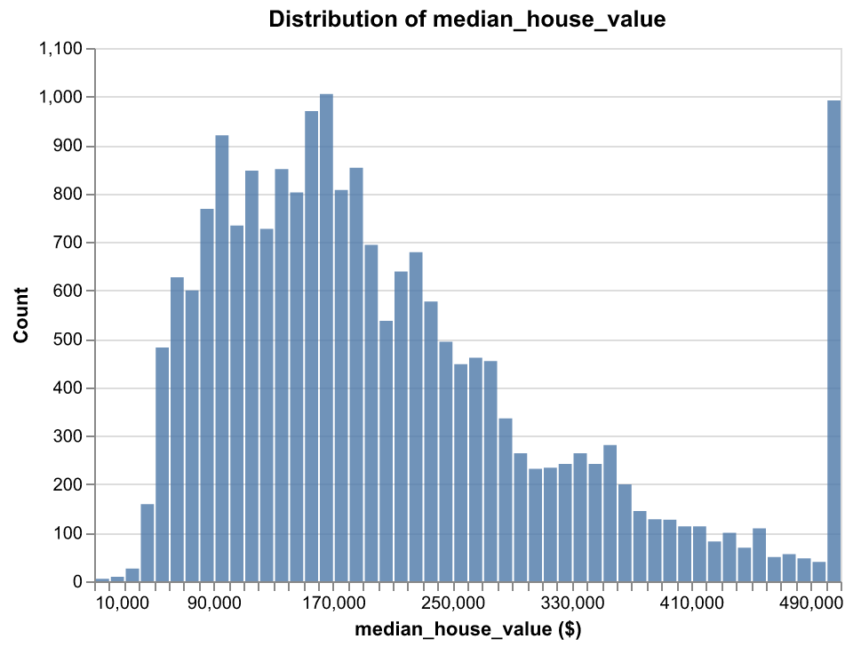
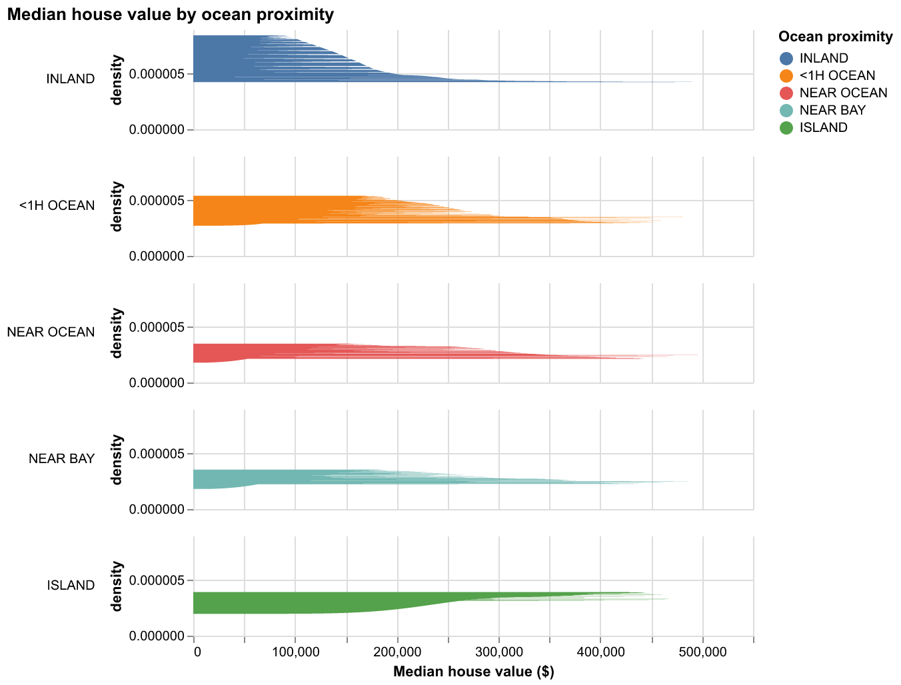

# Milestone 1 Proposal

## Section 1: Motivation and Purpose

**Our role:** Real Estate Firm
**Target audience:** Real Estate Traders

The California housing market is incredibly complex, and for real estate traders, finding the right investment depends on understanding how location and local demographics drive property values. It can be difficult to see the big picture when looking at raw data, often causing investors to miss out on undervalued neighborhoods or emerging trends. To solve this, we are building a data visualization app that lets traders easily explore the California housing dataset through interactive maps and charts. By filtering for factors like proximity to the ocean, median income, and house age, users can quickly spot price patterns and compare different regions at a glance. Our goal is to turn complicated census data into a clear, visual tool that helps traders make faster and more confident decisions on where to put their money.

## Section 2: Description of the Data

We will be visualizing a dataset of approximately 20,000 California housing blocks. Each block has 10 associated variables that describe the following characteristics, which we hypothesize could be helpful in determining the market value of properties in a given area:

- Geographic location (`longitude`, `latitude`, `ocean_proximity`)
- Property traits(`housing_median_age`, `total_rooms`, `total_bedrooms`)
- Demographic and economic indicators (`population`, `households`, `median_income`, `median_house_value`)

Using this data, we will also derive new variables, such as the average number of rooms per household (`rooms_per_household`) and the population density per house (`population_per_household`), as it would be interesting to explore if these ratios are stronger indicators of neighborhood prestige and investment potential than the raw totals alone.

## Section 3:Research Questions & Usage Scenarios

### Usage scenario

Dr. Elena Ramirez is an urban economics professor and researcher at the University of California, Berkeley. Her research focuses on understanding patterns in California's housing market during the late 20th century. She is interested in examining how economic and geographic factors — such as median income, proximity to the ocean, housing age, and housing density — were associated with property values in 1990.

She uses the California Housing 1990 Dashboard to explore a geographic overview of median house values across the state. Through an interactive map, she identifies clusters of high and low value regions. She then examines scatter plots comparing median house value with median income and housing median age to evaluate which factors appear most strongly associated with price. Using bar charts, she compares housing values across ocean proximity categories and across structural characteristics such as total rooms and number of households per block.

By interactively exploring these variables, Dr. Ramirez can better understand the drivers of housing value in 1990 California. Her findings may contribute to broader discussions on long-term housing affordability, regional disparities, and the economic geography of the state.

### User stories

**User story 1:** As an urban economics researcher, I want to analyze the relationship between median income and median house value in order to determine whether higher income areas were associated with higher property prices in 1990.

**User story 2:** As an urban economics researcher, I want to compare median house values across ocean proximity categories in order to assess whether coastal access was associated with higher property values in 1990.

**User story 3:** As an urban economics researcher, I want to visualize the geographic distribution of house values across California to identify spatial clusters of high and low value regions.

## Section 4: Exploratory Data Analysis

This section presents an exploratory analysis of the 1990 California housing census data. The goal is to characterize the distribution of key variables, assess data quality, identify relationships between predictors and the target (median house value), and uncover spatial patterns that matter for urban economics and investment decisions. These findings directly inform which variables and views should be prioritized in the dashboard. Run `python scripts/run_eda.py` to regenerate outputs.

### Data overview and quality

| metric         |      value |
|:---------------|-----------:|
| rows           | 20640      |
| columns        |    10      |
| memory (MB)    |     2.6981 |
| duplicate rows |     0      |

The dataset comprises 20,640 census block groups—the finest geographic level at which the U.S. Census Bureau publishes detailed housing statistics. With 10 variables per block and no duplicate rows, the data are well suited for interactive exploration. The modest memory footprint (~2.7 MB) allows for efficient client-side or server-side filtering and aggregation in a web-based dashboard, even when users apply multiple filters simultaneously.

| column         |   missing_count |   missing_pct |
|:---------------|----------------:|--------------:|
| total_bedrooms |             207 |             1 |

Missing data are confined to `total_bedrooms`, affecting only 1% of blocks (207 of 20,640). This pattern is common in census-derived housing data, where some blocks lack complete structural surveys. For modeling, simple imputation—such as the median number of bedrooms per block within the same ocean-proximity category—is typically sufficient. For visualization, excluding or imputing these cases has negligible impact on the overall picture.

| column             | dtype   |
|:-------------------|:--------|
| longitude          | float64 |
| latitude           | float64 |
| housing_median_age | float64 |
| total_rooms        | float64 |
| total_bedrooms     | float64 |
| population         | float64 |
| households         | float64 |
| median_income      | float64 |
| median_house_value | float64 |
| ocean_proximity    | str     |

Nine variables are numeric (float64), spanning geography (longitude, latitude), structure (housing age, room counts), and demographics (population, households, income, house value). The single categorical variable, `ocean_proximity`, captures waterfront access—a hypothesized driver of price premiums—and will be central for comparing coastal versus inland markets.

| column             |   count |        mean |         std |        min |         25% |         50% |         75% |         max |        q10 |         q90 |
|:-------------------|--------:|------------:|------------:|-----------:|------------:|------------:|------------:|------------:|-----------:|------------:|
| longitude          |   20640 |   -119.57   |      2.0035 |  -124.35   |   -121.8    |   -118.49   |   -118.01   |   -114.31   |  -122.29   |   -117.25   |
| latitude           |   20640 |     35.6319 |      2.136  |    32.54   |     33.93   |     34.26   |     37.71   |     41.95   |    33.63   |     38.48   |
| housing_median_age |   20640 |     28.6395 |     12.5856 |     1      |     18      |     29      |     37      |     52      |    13      |     46      |
| total_rooms        |   20640 |   2635.76   |   2181.62   |     2      |   1447.75   |   2127      |   3148      |  39320      |   941      |   4651.5    |
| total_bedrooms     |   20433 |    537.871  |    421.385  |     1      |    296      |    435      |    647      |   6445      |   198      |    965      |
| population         |   20640 |   1425.48   |   1132.46   |     3      |    787      |   1166      |   1725      |  35682      |   510      |   2566      |
| households         |   20640 |    499.54   |    382.33   |     1      |    280      |    409      |    605      |   6082      |   184      |    890      |
| median_income      |   20640 |      3.8707 |      1.8998 |     0.4999 |      2.5634 |      3.5348 |      4.7432 |     15.0001 |     1.9038 |      6.1592 |
| median_house_value |   20640 | 206856      | 115396      | 14999      | 119600      | 179700      | 264725      | 500001      | 82300      | 376600      |

Summary statistics reveal the scale and variability of each variable. Median house values span from roughly \$15,000 to \$500,000 (the latter being a censored cap in the original data), with a mean of about \$207,000 and a standard deviation of \$115,000—indicating substantial variation across blocks. Median income (reported in tens of thousands of dollars) averages 3.87, with values up to 15; this variable is expected to be a strong predictor of house value. Geographic coordinates cover California’s extent (longitude from −124 to −114, latitude from 33 to 42), and structural variables such as total rooms, population, and households exhibit high variance, with some blocks orders of magnitude larger than others. The histograms below visualize the full distribution of each numeric variable, helping to spot skewness, outliers, and multimodality.

### Target and predictor relationships

The target variable, `median_house_value`, is right-skewed: most blocks fall in the lower-to-mid range, with a long tail of high-value blocks (particularly in coastal and metro areas). This skew has important implications for modeling: ordinary least-squares regression on raw values can be distorted by outliers, and a log transformation (e.g., `log1p`) typically stabilizes variance and improves fit. The dashboard can offer both raw and log-scaled views to accommodate different analytical needs.

| column             |   correlation |
|:-------------------|--------------:|
| median_income      |        0.6881 |
| latitude           |       -0.1442 |
| total_rooms        |        0.1342 |
| housing_median_age |        0.1056 |
| households         |        0.0658 |
| total_bedrooms     |        0.0497 |
| longitude          |       -0.046  |
| population         |       -0.0246 |

Median income emerges as the strongest correlate of house value (r ≈ 0.69), consistent with economic theory: households with higher income bid up housing in desirable areas. Latitude shows a moderate negative correlation (r ≈ −0.14), reflecting the fact that Southern California coastal markets (lower latitude) include some of the state’s most expensive areas, while northern inland regions tend to be more affordable. Total rooms, housing age, and households have weaker but positive associations with value. Longitude and population show near-zero or slightly negative correlations. The correlation heatmap and scatter matrix below illustrate these patterns and highlight multicollinearity among related variables (e.g., rooms, bedrooms, households).

The scatter plots of median house value against selected predictors confirm the correlation results. Income displays a strong, roughly linear relationship with value—higher-income blocks reliably command higher prices. Housing age and geographic coordinates show weaker, more diffuse associations; they may capture residual location effects that income does not fully absorb. For traders, this suggests that income is the primary screening variable, but geography and structure add nuance when comparing otherwise similar neighborhoods.

### Categorical EDA

| ocean_proximity   |   count |
|:------------------|--------:|
| <1H OCEAN         |    9136 |
| INLAND            |    6551 |
| NEAR OCEAN        |    2658 |
| NEAR BAY          |    2290 |
| ISLAND            |       5 |

The distribution of `ocean_proximity` is uneven: the largest categories are “<1H OCEAN” (within an hour of the ocean, 9,136 blocks) and “INLAND” (6,551 blocks). “NEAR OCEAN” and “NEAR BAY” together account for about one-quarter of blocks, and only five blocks are classified as “ISLAND.” The bar chart of median house value by category reveals a striking coastal premium: ocean-adjacent and bay-adjacent blocks consistently show higher median values than inland blocks. This pattern supports the amenity-value hypothesis—waterfront access and coastal climate are capitalized into property prices. For the dashboard, enabling comparisons across ocean-proximity categories will allow traders to assess whether coastal premiums are uniform or vary by region (e.g., Bay Area vs. Southern California).

### Spatial Distribution and Clusters (Urban Economics Focus)

Geographic visualization is central to understanding California’s housing landscape. As an urban economics researcher or trader, identifying where high- and low-value blocks concentrate—and how those clusters align with income, coast, and infrastructure—is essential for evaluating investment opportunities and regional price gradients.

The scatter plot of longitude and latitude, colored by median house value, reveals strong spatial clustering. The San Francisco Bay Area and the greater Los Angeles basin emerge as distinct high-value corridors (darker shading), while the Central Valley, the Inland Empire away from the coast, and much of northern California show lower values. Coastal strips tend to be more expensive than adjacent inland areas, and major highways and metro centers appear to anchor elevated price zones. The interactive nature of this view—with zoom, pan, and tooltips—will let dashboard users drill into specific regions and compare neighborhoods.

Aggregating blocks into a spatial grid (binning longitude and latitude) smooths noise and emphasizes regional gradients. The resulting heatmap makes it easier to see broad patterns: elevated median values along the coast, around San Francisco and Los Angeles, and in parts of San Diego, contrasted with lower values in the Central Valley and northern interior. Traders can use this view to identify undervalued inland pockets or overvalued coastal segments, and to assess how far price premiums extend from metro cores.

Focusing on the top 10% (green) and bottom 10% (red) value blocks highlights spatial segregation. High-value blocks concentrate along the coast and around major metros; low-value blocks are overwhelmingly inland and in less urbanized areas. The geography of extremes reinforces the hypothesis that location—proximity to coast, employment centers, and amenities—is a primary driver of California’s housing price structure. For the dashboard, allowing users to toggle between raw scatter, binned aggregation, and extremity views will support both exploratory and hypothesis-driven analysis.

