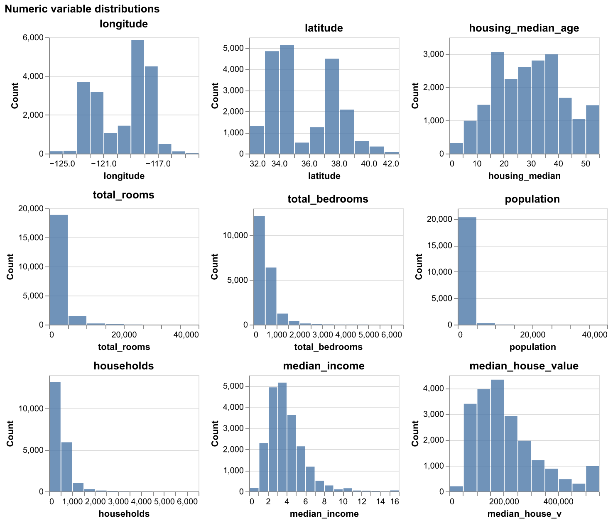
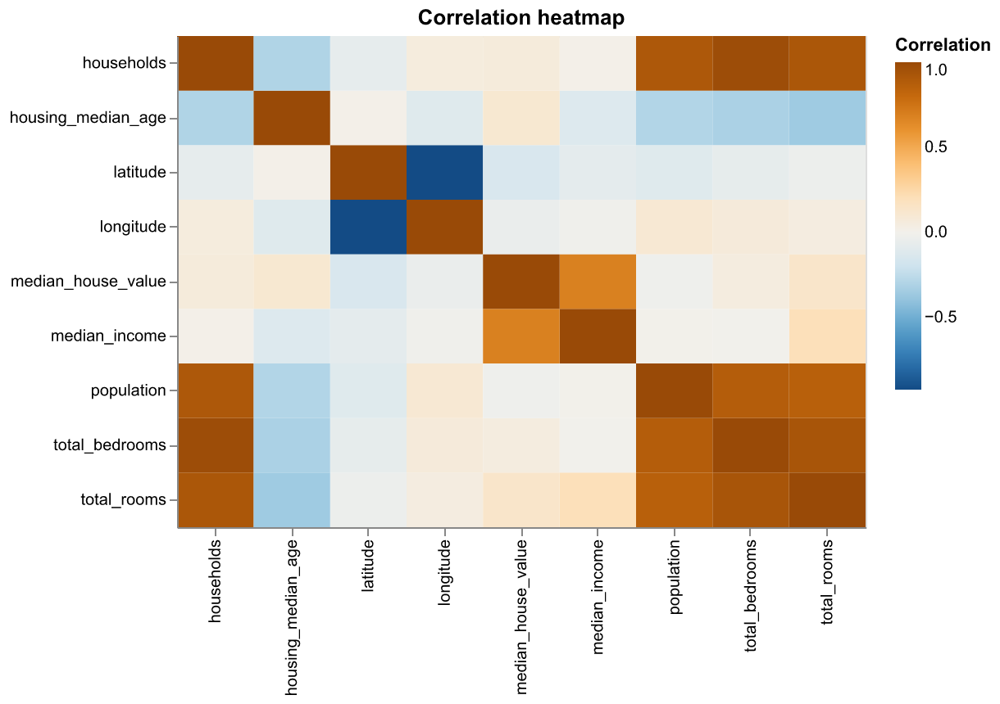
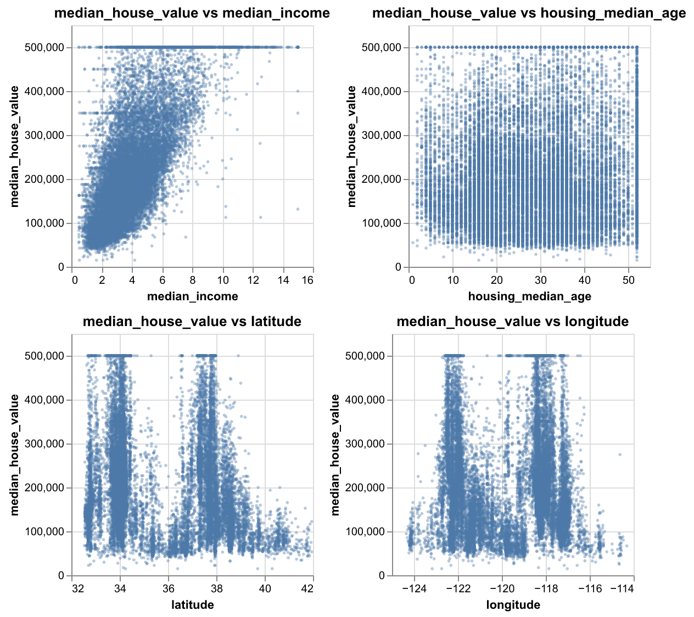
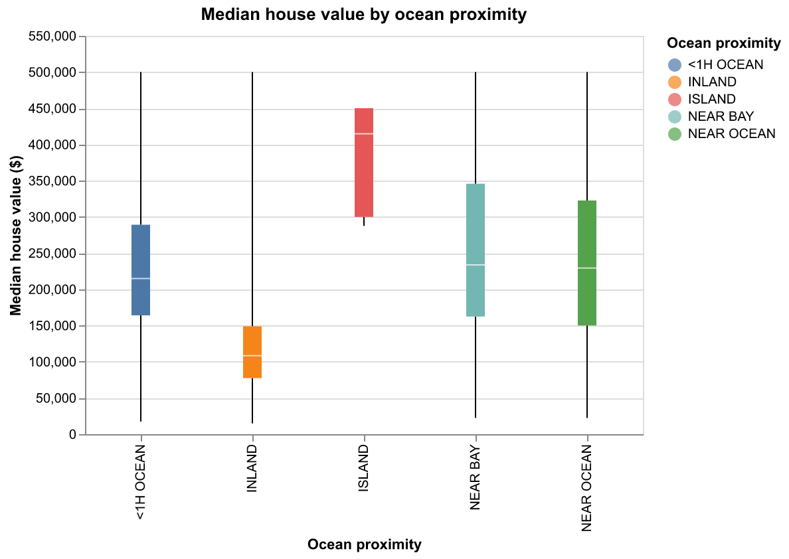
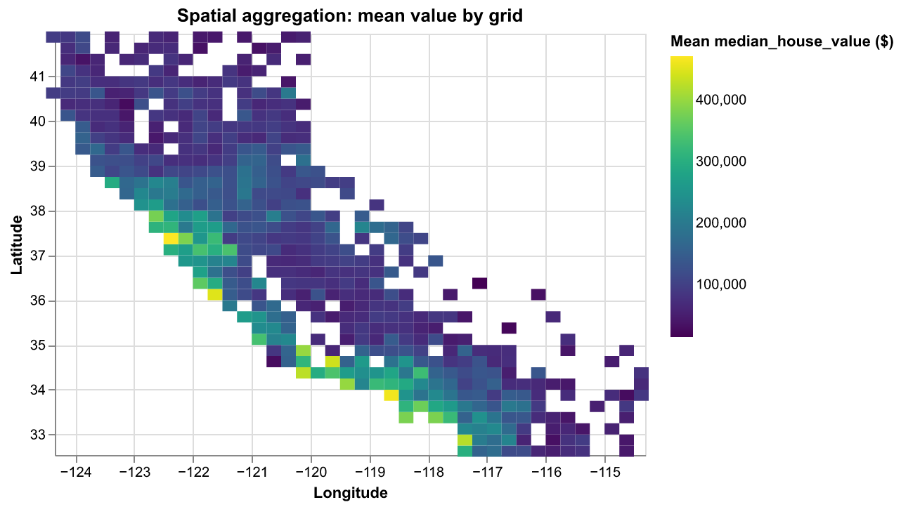
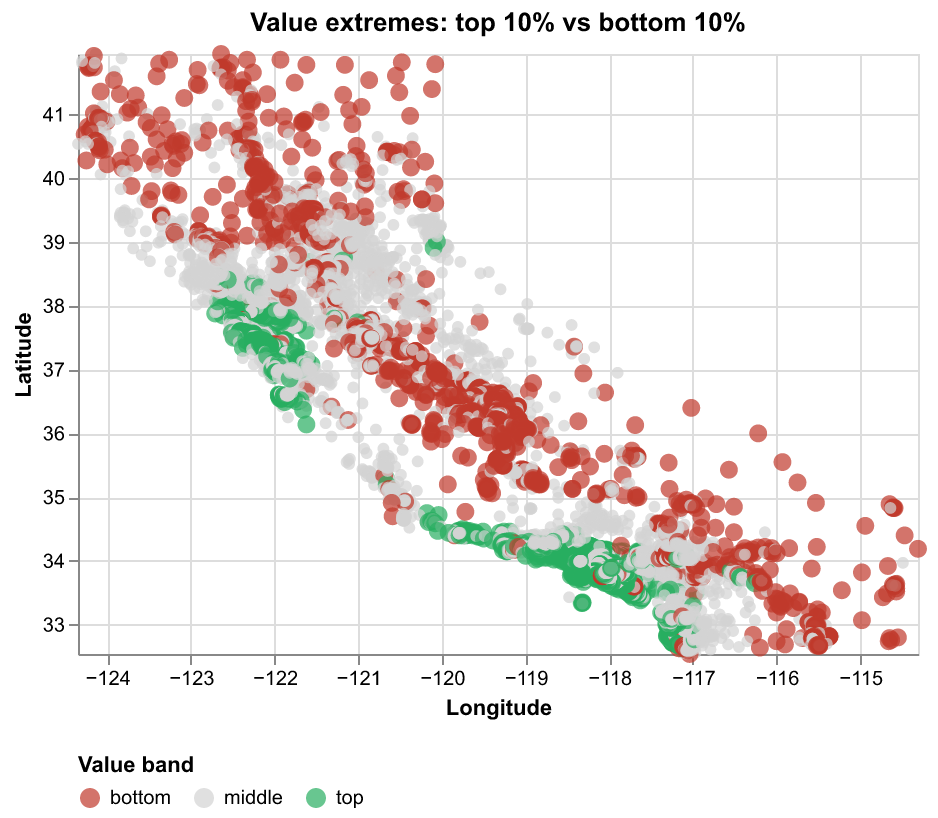

# Milestone 1 Proposal

## Section 1: Motivation and Purpose

**Our role:** Real Estate Firm
**Target audience:** Real Estate Traders

The California housing market is incredibly complex, and for real estate traders, finding the right investment depends on understanding how location and local demographics drive property values. It can be difficult to see the big picture when looking at raw data, often causing investors to miss out on undervalued neighborhoods or emerging trends. To solve this, we are building a data visualization app that lets traders easily explore the California housing dataset through interactive maps and charts. By filtering for factors like proximity to the ocean, median income, and house age, users can quickly spot price patterns and compare different regions at a glance. Our goal is to turn complicated census data into a clear, visual tool that helps traders make faster and more confident decisions on where to put their money.

## Section 2: Description of the Data

We will be visualizing a dataset of approximately 20,000 California housing blocks. Each block has 10 associated variables that describe the following characteristics, which we hypothesize could be helpful in determining the market value of properties in a given area:

- Geographic location (`longitude`, `latitude`, `ocean_proximity`)
- Property traits(`housing_median_age`, `total_rooms`, `total_bedrooms`)
- Demographic and economic indicators (`population`, `households`, `median_income`, `median_house_value`)

Using this data, we will also derive new variables, such as the average number of rooms per household (`rooms_per_household`) and the population density per house (`population_per_household`), as it would be interesting to explore if these ratios are stronger indicators of neighborhood prestige and investment potential than the raw totals alone.

## Section 3:Research Questions & Usage Scenarios

### Usage scenario

Dr. Elena Ramirez is an urban economics professor and researcher at the University of California, Berkeley. Her research focuses on understanding patterns in California's housing market during the late 20th century. She is interested in examining how economic and geographic factors — such as median income, proximity to the ocean, housing age, and housing density — were associated with property values in 1990.

She uses the California Housing 1990 Dashboard to explore a geographic overview of median house values across the state. Through an interactive map, she identifies clusters of high and low value regions. She then examines scatter plots comparing median house value with median income and housing median age to evaluate which factors appear most strongly associated with price. Using bar charts, she compares housing values across ocean proximity categories and across structural characteristics such as total rooms and number of households per block.

By interactively exploring these variables, Dr. Ramirez can better understand the drivers of housing value in 1990 California. Her findings may contribute to broader discussions on long-term housing affordability, regional disparities, and the economic geography of the state.

### User stories

**User story 1:** As an urban economics researcher, I want to analyze the relationship between median income and median house value in order to determine whether higher income areas were associated with higher property prices in 1990.

**User story 2:** As an urban economics researcher, I want to compare median house values across ocean proximity categories in order to assess whether coastal access was associated with higher property values in 1990.

**User story 3:** As an urban economics researcher, I want to visualize the geographic distribution of house values across California to identify spatial clusters of high and low value regions.

## Section 4: Exploratory Data Analysis

In this section, we will perform an exploratory data analysis on the California housing data. We will use the data to answer the research questions related to user story 3.[^1]

[^1]: The code used to generate the plots in this report was produced with the assistance of a LLM and has been modified as needed for our specific use case.

The dataset contains nine numeric variables (geography, structure, demographics) and one key categorical variable, `ocean_proximity`, which enables analysis of waterfront versus inland markets.

The plots above show that California’s highest house values concentrate along the coast and in major metro areas, while inland regions tend to have much lower values. Spatial aggregation and value extremes highlight the strong coastal premium and regional disparities, underscoring geography as a key driver of property prices.

The bar chart below shows median house values categorized by ocean proximity. Coastal neighborhoods generally command higher prices, highlighting the premium for ocean access.

### Spatial Distribution and Clusters (Urban Economics Focus)

Geographic visualization is central to understanding California’s housing landscape. As an urban economics researcher, identifying where high- and low-value blocks concentrate—and how those clusters align with income, coast, and infrastructure—is essential for evaluating investment opportunities and regional price gradients.

Higher house values cluster along the coast; inland regions show lower prices. Users can interactively explore regions and value patterns.

Binning blocks into a heatmap highlights coastal and metro areas as high-value regions, with lower values inland.

The top 10% of house values cluster along the coast, while the lowest are inland.

